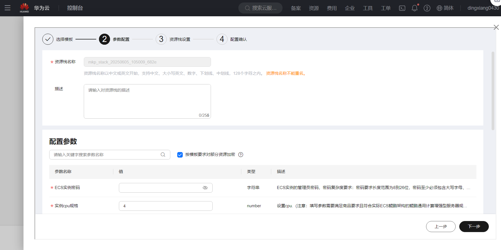
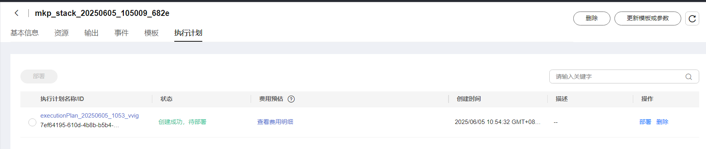
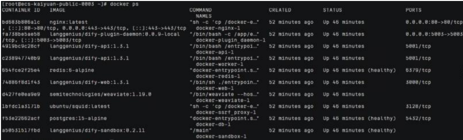
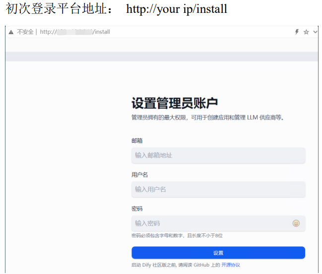

# Dify Community Edition
## Product Link
[Dify Community Edition](https://marketplace.huaweicloud.com/intl/hidden/contents/9be11bb4-fea0-417c-a246-498605e0c887)

## Product Description
[Dify](https://dify.ai/) is an open-source Large Language Model (LLM) application development platform. It combines the concepts of Backend as a Service and LLMOps, enabling developers to quickly build production-ready generative AI applications. Even non-technical users can participate in defining AI applications and managing data operations.

Dify comes with built-in key technology stacks for constructing LLM applications, including:
- Support for hundreds of models
- Intuitive Prompt orchestration interface
- High-quality RAG engine
- Robust Agent framework
- Flexible workflow orchestration
- User-friendly interface and API

This saves developers significant time from reinventing the wheel, allowing them to focus on innovation and business requirements.

This product is provided as a pre-installed image on Kunpeng Cloud with Ubuntu 24.04 and HCE 2.0 systems.

## Purchasing the Product
Search for "Dify Community Edition" in the Cloud Marketplace. 
Configuration guidelines:
- Use recommended region and specifications
- Choose billing method based on your needs:
  - Pay-as-you-go (recommended for short-term use)
  - Monthly/Yearly (recommended for long-term use)
- Click "Buy Now" after confirming configuration

### Deploy Using RFS Template

Fill in required fields and click Next

After creating the plan, click Confirm

Click Deploy to execute the plan

"Apply required resource success" indicates successful resource creation

### ECS Console Configuration
#### Prerequisites

Before ECS console configuration, configure **Security Group Rules**:

> **Security Group Rules:**
> - Allow inbound port 80 (must include your client IP)
> - Allow inbound port `22` for CloudShell connection
> - Enable all outbound traffic

#### Create ECS

Navigate to [ECS Purchase](https://support.huaweicloud.com/qs-ecs/ecs_01_0103.html) page:

Select CPU Architecture

Select Server Specifications

Select Image

Complete other parameters and click "Buy Now"

> **Important Notes:**
- You may create your own VPC
- Select the security group configured in [**Prerequisites**](#prerequisites)
- For Elastic IP, choose "Buy Now" with "Pay-by-traffic" (recommended 5Mbit/s)
- Advanced configuration requires custom data injection - select "Set Later" for credentials
- Other options can remain default

## Product Usage
### Check Dify Process
- After login, check Dify processes with: `docker ps`

- Access Dify platform via browser

### Reference Documentation
[Dify Documentation](https://docs.dify.ai/)
